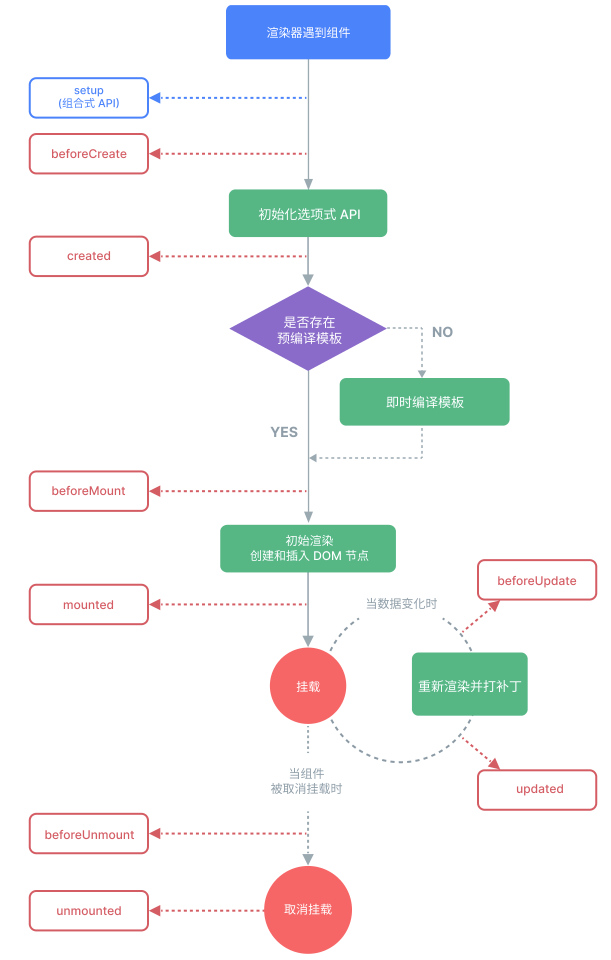

# 条件渲染 IfDemo.vue
## 表达式为true时渲染组件
- v-if、v-show指令:
```html
<template>
  <h2>条件渲染</h2>
  <div v-if="flag">能看见吗</div>
  <div v-else>那你只能看到我了</div>
  <div v-if="type === 'A'">A</div>
  <div v-else-if="type === 'B'">B</div>
  <div v-else-if="type === 'C'">C</div>
  <div v-else>Not&nbsp;A&nbsp;B&nbsp;C</div>
  <div v-show="flag">能看见吗2</div>
</template>

<script>
  export default {
    data (){
      return {
        flag: true,
        type: "B"
      }
    }
  }
</script>
```

- v-if:切换开销大
- v-show:初始渲染开销大

- 频繁切换状态:&nbsp;v-show


# 列表渲染 ListDemo.vue
- v-for指令：
```html
<template>
  <h3>列表渲染</h3>
  <h4>简单数据与数组下标</h4>
  <p v-for="(name, index) in names">{{ index }}-{{ name }}列表</p>
  <p v-for="(name, index) of names">{{ index }}-{{ name }}列表</p>
  <h4>复杂数据</h4>
  <div v-for="result in results">
    <h5>{{ result.id }}</h5>
    <p>{{ result.text }}</p>
  </div>
  <div v-for="result of results">
    <h5>{{ result.id }}</h5>
    <p>{{ result.text }}</p>
  </div>
  <h4>对象属性</h4>
  <div>
    <p v-for="(value, key, index) in usrInfo">{{ value }}-{{ key }}-{{ index }}</p>
  </div>
</template>

<script>
  export default {
    data() {
      return {
        /*简单数据 */
        names: ['A', 'B', 'C', 'D'],
        // 复杂数据
        results: [
          {
            'id': 123456,
            'text': "为从1"
          },
          {
            'id': 478154,
            'text': "为从2"
          },
          {
            'id': 154584,
            'text': "为从3"
          },
          {
            'id': 478154,
            'text': "为从4"
          }
        ],
        // 对象属性
        usrInfo: {
          name: "Tom",
          sex: "男",
          age: 18
        }
      }
    }
  }
</script>
```

# 列表循环补充-通过key管理状态 KeyDemo.vue
- vue更新策略:就地更新，不改变元素顺序，而是重新渲染，消耗大
- 为每一个列表元素添加唯一key，以重用和重排现有元素，减少消耗
- key为基础类型，使用v-bind绑定到元素，推荐使用跟随数据移动的值，eg:学号、id
```html
<template>
  <h3>Key属性添加到v-for中</h3>
  <p v-for="(name, index) of names" :key="index">{{ index }}-{{ name }}</p>
</template>

<script>
  export default {
    data() {
      return {
        names: ['A', 'B', 'C', 'D']
      }
    }
  }
</script>
```

# 事件处理器 EventDemo1.vue EventDemo2.vue
- v-on(简写为@)，eg：v-on:click="methodName"或@click="click"
### 事件处理器类型
- 1、内链事件处理器：事件触发时执行内联的JavaScript语句，与onclick类似
```html
<template>
  <h3>內联事件处理器</h3>
  <button @click="count++">Add</button>
  <p>{{ count }}</p>
</template>

<script>
  export default {
    data() {
      return {
        count: 0
      }
    }
  }
</script>
```
- 2、方法事件处理器：一个指向组件上定义的方法的属性名或是路径
```html
<template>
  <h3>方法事件处理器</h3>
  <button @click="addCount">Add</button>
  <p>{{ count }}</p>
</template>

<script>
  export default {
    data() {
      return {
        count: 0
      }
    },
    methods:{
      addCount(){
        this.count++
      }
    }
  }
</script>

```
# 事件参数 EventDemo3.vue
- 事件参数可以获取event对象、通过事件传递参数
```html
<template>
    <h3>事件传参</h3>
    <button @click="addCount">Add</button>
    <p>{{ count }}</p>
    <button @click="transData('Hello')">TransData</button>
    <p @click="getName(name)" v-for="(name, index) of names" :key="index">{{ name }}</p>
    <p>传参同时获取event</p>
    <!-- 注意使用$传递event -->
    <p @click="getNameAndEvent(name, $event)" v-for="(name, index) of names" :key="index">{{ name }}</p>
  </template>
  
  <script>
    export default {
      data() {
        return {
          count: 0,
          names: ['AA', 'BB', 'CC', 'DD']
        }
      },
      methods:{
        // 获取event对象
        addCount(e) {
          e.target.innerHTML = "Add" + this.count
          console.log(e)
          this.count++
        },
        // 传递数据
        transData(msg) {
          console.log(msg)
        },
        getName(name) {
          console.log(name)
          
        },
        // 传参同时获取event
        getNameAndEvent(name, e){
          console.log(name)
          console.log(e)
        }
      }
    }
  </script>
```

# 事件修饰符 EventDemo4.vue
### 在处理事件时调用 event.preventDefault() 或 event.stopPropagation() 是很常见的。尽管我们可以直接在方法内调用，但如果方法能更专注于数据逻辑而不用去处理 DOM 事件的细节会更好。为解决这一问题，Vue 为 v-on 提供了事件修饰符。修饰符是用 . 表示的指令后缀，常用包含以下这些：
- 1、.stop&nbsp;&nbsp;&nbsp;&nbsp;&nbsp;&nbsp;&nbsp;&nbsp;&nbsp;&nbsp;&nbsp;&nbsp;&nbsp;&nbsp;&nbsp;&nbsp;&nbsp;&nbsp;&nbsp;&nbsp;阻止事冒泡(触发子元素事件时，事件冒泡到父元素从而触发父元素事件)
- 2、.prevent&nbsp;&nbsp;&nbsp;&nbsp;&nbsp;&nbsp;&nbsp;&nbsp;&nbsp;&nbsp;&nbsp;&nbsp;&nbsp;&nbsp;&nbsp;阻止默认事件
- 3、.once&nbsp;&nbsp;&nbsp;&nbsp;&nbsp;&nbsp;&nbsp;&nbsp;&nbsp;&nbsp;&nbsp;&nbsp;&nbsp;&nbsp;&nbsp;&nbsp;&nbsp;&nbsp;&nbsp;事件只会触发一次
- 4、.enter&nbsp;&nbsp;&nbsp;&nbsp;&nbsp;&nbsp;&nbsp;&nbsp;&nbsp;&nbsp;&nbsp;&nbsp;&nbsp;&nbsp;&nbsp;&nbsp;&nbsp;&nbsp;&nbsp;回车按键触发
```url
参考地址：
https://cn.vuejs.org/guide/essentials/event-handling.html#event-modifiers
```

```html
<template>
  <h2>事件修饰符</h2>
  <a @click.prevent="clickHandle($event)" href="https://www.baidu.com">百度一下(通过event对象阻止默认事件)</a>
  <div @click="clickDiv">
    <p @click.stop="clickP">测试冒泡</p>
  </div>
</template>

<script>
export default {
  data() {
    return {

    }
  },
  methods: {
    clickHandle(e) {
      // 通过event对象阻止默认事件
      // e.preventDefault();
      console.log('点击了');
    },
    clickDiv() {
      console.log('Div');
    },
    clickP() {
      console.log('P');
    }
  }
}
</script>
```

# 数组变化侦测 ArrayList.vue
### 变更方法(变更原数组)
##### Vue监听响应式数组的变更方法，并在他们被调用时触发相应的更新
- 1、.push()
- 2、.pop()
- 3、.shift()
- 4、.unshift()
- 5、.splice()
- 6、.sort()
- 7、.reverse()

### 替换数组
##### 对不可变方法(返回新数组)，如：fiter()、concat()、slice()，应该替换数组以更新UI

```html
<template>
  <h3>数组变化侦测</h3>
  <div>
    <p>可变方法</p>
    <button @click="addData">添加数据</button>
    <ul>
      <li v-for="(name1, index) of names1" :key="index">{{ name1 }}</li>
    </ul>
    <p>当前数组1：{{ names1 }}</p>
  </div>
  <div>
    <p>不可变方法，采用替换原数组策略</p>
    <button @click="chandeArray">替换原数组</button>
    <ul>
      <li v-for="(name2, index) of names2" :key="index">{{ name2 }}</li>
    </ul>
    <p>当前数组2：{{ names2 }}</p>
  </div>
</template>

<script>
  export default {
    data() {
      return {
        names1: ["AAA", "BBB", "CCC", "DDD"],
        names2: ["AAA", "BBB", "CCC", "DDD"]
      }
    },
    methods: {
      addData() {
        // 引起UI自动更新的方法
        this.names1.push("EEE");
        // 不会引起UI自动更新
        this.names1.concat(["FFF"]);
      },
      chandeArray() {
        this.names2 = this.names2.concat(["EEE", "FFF"]);
      }
    }
  }
</script>

<style>
  button {
    background-color: #7af;
    height: 40px;
    border-radius: 10px;
  }
</style>
```

# 计算属性 ComputeDemo.vue
### 处理复杂逻辑
#### 计算属性与方法的区别：
- 计算属性：**计算属性会基于其响应式依赖被缓存**。一个计算属性仅会在其响应式依赖更新时才重新计算
- 方法：方法调用**总是**会在重渲染发生时再次执行函数。

# 属性class绑定 ClassDemo.vue
```html
<template>
  <p :class="{ 'active': isActive, 'danger': hasError }">Class样式绑定1-对象</p>
  <p :class="ObjClass">Class样式绑定2</p>
  <p :class="[arrActive, arrHas]">Class样式绑定3-数组</p>
  <p :class="[isActive ? 'danger': '']">Class样式绑定4</p>
  <p :class="[isActive ? 'danger': { 'danger': hasError }]">Class样式绑定5-数组嵌套对象</p>
</template>

<script>
  export default {
    data() {
      return {
        isActive: true,
        hasError: true,
        ObjClass: {
          'active': true,
          'danger': true
        },
        arrActive: "active",
        arrHas: 'danger'
      }
    }
  }
</script>

<style>
  .danger {
    color: red;
  }
</style>
```
# style绑定 类似class绑定
<br>

# 侦听器 WatchDemo.vue
## 使用watch选项在每次响应式属性发生变化时触发一个函数
```html
<template>
  <h3>侦听器</h3>
  <p>{{ msg }}</p>
  <button @click="updateHandle">修改数据</button>
</template>

<script>
  export default {
    data() {
      // 监听return中的数据
      return {
        msg: "Hello World!"
      }
    },
    methods: {
      updateHandle(){
        this.msg = "Hello Vue!"
      }
    },
    // 监听气的函数名称与其监听的数据的key值一致
    watch :{
      /**
       * @param newValue: 新数据
       * @param oldValue: 旧数据
       */
      msg(newValue, oldValue){
        console.log("newValue: ", newValue);
        console.log("oldValue: ", oldValue)
      }
    }
  }
</script>
```

# 表单的数据输入绑定 FormDemo.vue
### 使用v-model指令
### 修饰符：
- .lazy：触发搜索、回车才更新数据
- .number：只能输入数字
- .trim：去除首尾空格
```html
<template>
  <h3>表单输入绑定</h3>
  <form>
    <input type="text" v-model="msg"> <!-- msg根据输入框中的内容实时变化 -->
    <p>{{ msg }}</p>
    <input type="checkbox" id="checkbox" v-model="checked">
    <label for="checked">{{ checked }}</label>
  </form>
</template>

<script>
  export default {
    data() {
      return {
        msg: "",
        checked: false
      }
    }
  }
</script>
```

# 模板引用 获取DOM RefDemo.vue
### 使用ref属性
```html
<template>
  <div ref="container" class="container">{{ content }}</div>
  <button @click="getElement">获取元素</button>
</template>

<script>
  /**
   * 内容改变：{{ 模板语法 }}
   * 属性改变：v-bind指令
   * 事件：v-on指令
   */
  export default {
    data() {
      return {
        content: "内容"
      }
    },
    methods: {
      /**
       * 借ref可以使用this.$refs获取和操作原生的dom元素
       */
      getElement() {
        console.log(this.$refs.container)
        this.$refs.container.innerHTML = "hhhhhhh"
      }
    }
  }
</script>
```

# 组件传递数据 props
### ！！！ props只能从父组件传递数据到子组件
### ！！！ prop是只读的，即子组件不可修改父组件传递的数据
- props可以传递任何类型的值
### Parent.vue
```html
<template>
  <h3>Parent</h3>
  <Child title1="Parent传递的数据" :title2="msg"/>
</template>

<script>
  import Child from "./Child.vue";
  export default {
    components: {
      Child
    },
    data() {
      return{
        msg: "动态传递的数据"
      }
    }
  }
</script>
```
# Child.vue
```html
<template>
  <h3>Child</h3>
  <p>{{ title1 }}</p>
  <p>{{ title2 }}</p>
</template>

<script>
  export default {
    props: ["title1", "title2"]
  }
</script>
```
# props效验
### A.vue
```html
<template>
  <h3>A</h3>
  <B :title="title" :age="age" :names="names"/>
</template>

<script>
  import B from './B.vue'
  export default {
    components: {
      B
    },
    data() {
      return {
        title: "测试",
        age: 20,
        names: [1, 2, 3, 4, 5]
      }
    }
  }
</script>
```
### B.vue
```html
<template>
  <h3>B</h3>
  <p>{{ title }}</p>
  <p>{{ age }}</p>
  <p v-for="name of names">{{ name }}</p>
</template>

<script>
  export default {
    data(){
      return {

      }
    },
    props :{
      title:{
        type: [String, Number, Array, Object]
      },
      age: {
        type: Number,
        default: 0  // 默认值
        // 数字和字符串可以直接default，但数组和对象必须用工厂函数返回默认值
      },
      names:{
        type:Array,
        default(){
          return ["空"]
        }
      },
      test: {
        type: String,
        required: true  // 必选项
      }
    }
  }
</script>
```
# 组件事件
#### 使用$emit方法触发自定义事件，以在组件间传递数据
## 提示：组件间传递数据的方式
- 1、父传子：props
- 2、子传父：组件事件
### ComponentEvent.vue
```html
<template>
  <h3>组件事件</h3>
  <Child2 @aEvent="getData"/>
</template>

<script>
  import Child2 from "./Child2.vue";
  export default{
    components: {
      Child2
    },
    methods:{
      getData(data){
        console.log("触发事件", data);
      }
    }
  }
</script>
```
### Child2.vue
```html
<template>
  <h3>子组件事件</h3>
  <button @click="TansDataToParent">向父组件传递数据</button>
</template>

<script>
  export default{
    methods:{
      TansDataToParent(){
        // 自定义事件
        this.$emit("aEvent", "子组件数据") // aEvent:事件名，后面的是数据
      }
    }
  }
</script>
```
# 组件事件配合v-model
### Main.vue
```html
<template>
  <h3>Main</h3>
  <p>搜索结果: {{ msg }}</p>
  <Search @searchEvent="getSearch"/>
</template>

<script>
  import Search from './Search.vue';
  export default {
    data(){
      return {
        msg: ""
      }
    },
    components: {
      Search
    },
    methods:{
      getSearch(data){
        this.msg = data
      }
    }
  }
</script>
```
### Search.vue
```html
<template>
  搜索: <input type="text" v-model="search">
</template>

<script>
  export default{
    data(){
      return {
        search: ""
      }
    },
    methods:{},
    watch: {
      search(a, b){
        this.$emit("searchEvent", a);
      }
    }
  }
</script>
```
# 组件数据传递 props实现子传父
### A1.vue
```html
<template>
  <h3>A1</h3>
  <B1 :onEvent="dataFn"/>
  <p>{{ msg }}</p>
</template>

<script>
  import B1 from './B1.vue';
  export default{
    data(){
      return {
        msg:""
      }
    },
    components: {
      B1
    },
    methods: {
      dataFn(data){
        console.log(data);
        this.msg = data
      }
    }
  }
</script>
```
### B1.vue
```html
<template>
  <h3>B1</h3>
  <p>{{ onEvent("传递数据") }}</p>
</template>

<script>
  export default{
    data(){
      return {
        
      }
    },
    props:{
      onEvent: Function
    }
  }
</script>
```

# 插槽 (Slot) 
#### 为子组件传递模板片段，让子组件在其组件中渲染这些片段
### SlotBase.vue
```html
<template>
  <h3>Slot插槽基础知识</h3>
  <slot></slot>
</template>
```
### App.vue片段
```html
<SlotBase>
  <div>
    <h3>插槽标签</h3>
    <p>插槽内容</p>
  </div>
</SlotBase>
```
## 插槽作用域
- 插槽内容可以访问父组件的数据作用域，因为插槽内容本身是在父组件模板中定义的
### SlotTwo.vue片段
```html
<template>
  <h3>Slot续集</h3>
  <slot>插槽默认值</slot>
</template>
```
### App.vue片段
```html
<template>
  <SlotTwo>
    <div>
      <p>{{ msg }}</p>
    </div>
  </SlotTwo>
</template>
<script>
  data(){
    return {
      msg: "插槽续集内容(父元素)"
    }
  }
</script>
```

## 具名插槽
### SlotTwo.vue片段
```html
<template>
  <h3>Slot续集</h3>
  <slot name="header">插槽默认值</slot>
  <hr>
  <slot name="main">插槽默认值</slot>
</template>
```
### App.vue片段
``` html
<SlotTwo>
  <template v-slot:header>
    <h3>插槽标签</h3>
  </template>
  <!-- v-slot可简写为# -->
  <template #main>
    <p>插槽内容</p>
  </template>
</SlotTwo>
```
## 同时使用父子组件数据域的数据
### SlotThree.vue
```html
<template>
  <h3>Slot再续集</h3>
  <slot :msg="chMsg">插槽默认数据</slot>
  <hr>
  <slot name="header" :msg2="chMsg">插槽默认数据</slot>
</template>

<script>
  export default {
    data() {
      return {
        chMsg: "子组件数据"
      }
    }
  }
</script>
```
### App.vue片段
```html
<template>
  <SlotThree v-slot="slotProps">
    <h3>{{ curText }} - {{ slotProps.msg }}</h3>
  </SlotThree>
  <hr>
  // 具名插槽的传递
  <SlotThree>
    <template #header="slotProps2">
      <h3>只有-{{ slotProps2.msg2 }}</h3>
    </template>
  </SlotThree>
</template>
<script>
  export default {
    data() {
      return {
        curText: "测试内容"
      }
    }
  }
</script>
```

# 组件生命周期
#### 从创建到销毁的时间
- 每个 Vue 组件实例在创建时都需要经历一系列的初始化步骤，比如设置好数据侦听，编译模板，挂载实例到 DOM，以及在数据改变时更新 DOM。在此过程中，它也会运行被称为生命周期钩子的函数，让开发者有机会在特定阶段运行自己的代码。
### 生命周期示意图


### 生命周期函数
- 1、创建期：beforeCreate、created
- 2、挂载期：beforeMount、mounted
- 3、更新期：beforeUpdata、updated
- 4、销毁期：beforeUnmount、unmounted
### 生命周期应用
- 1、通过ref获取dom结构
- 2、模拟网络请求获取数据
#### Lifeprod.vue
```html
<template>
  <h3>组件生命周期函数应用</h3>
  <p ref="name">测试数据</p>
  <ul>
    <li v-for="item in banner">
      <h4>{{ item.title }}</h4>
      <p>{{ item.content }}</p>
    </li>
  </ul>
</template>

<script>
export default {
  data(){
    return {
      banner: []
    }
  },
  created(){
    // 模拟网络请求，实际应用中应该先渲染结构，再获取网络 数据
    this.banner = [
      {
        "title": 1,
        "content": "A"
      },
      {
        "title": 2,
        "content": "B"
      },
      {
        "title": 3,
        "content": "C"
      },
      {
        "title": 4,
        "content": "D"
      },
    ]
  },
  beforeMount(){
    console.log(this.$refs.name)
  },
  mounted(){
    console.log(this.$refs.name)
  },
}
</script>
```
<br>

# 动态组件 实现组件间的切换
### 使用 ```<component :is="组件名称"></component>```渲染出组件
#### App.vue片段
```html
<template>
  <component :is="NowComponent"></component>
  <button @click="changeComponent">改变组件</button>
</template>

<script>
  import DynamicA from './components/DynamicA.vue';
  import DynamicB from './components/DynamicB.vue'

  export default {
    components: {
      DynamicA,
      DynamicB
    },
    data(){
      return {
        NowComponent: "DynamicA"
      }
    },
    methods: {
      changeComponent(){
        this.NowComponent = this.NowComponent == "DynamicA" ? "DynamicB" : "DynamicA"
      }
    }
  }
</script>

```
<br>

# 组件保持存活
### 使用 ```<component :is="组件名称"></component>```渲染出的组件被来回切换时组件会被卸载。可以通过```<keep-alive>```使被切换掉的组件保持存活
### App.vue片段
```html
<template>
  <keep-alive>
    <component :is="NowComponent"></component>
  </keep-alive><br>
  <button @click="changeComponent">改变组件</button>
</template>

<script>
  import DynamicA from './components/DynamicA.vue';
  import DynamicB from './components/DynamicB.vue'

  export default {
    components: {
      DynamicA,
      DynamicB
    },
    data(){
      return {
        NowComponent: "DynamicA"
      }
    },
    methods: {
      changeComponent(){
        this.NowComponent = this.NowComponent == "DynamicA" ? "DynamicB" : "DynamicA"
      }
    }
  }
</script>

```
<br>

# 异步组件——优化组件/项目性能
### 仅在需要时加载组件，使用```defineAsyncComponent```方法实现
### App.vue片段
```html
<template>
  <keep-alive>
    <component :is="NowComponent"></component>
  </keep-alive><br>
  <button @click="changeComponent">改变组件</button>
</template>

<script>
  import DynamicA from './components/DynamicA.vue';
  // 异步导入组件B
  import { defineAsyncComponent } from "vue";
  
  const DynamicB = defineAsyncComponent(() => {
    import('./components/DynamicB.vue')
  })

  export default {
    components: {
      DynamicA,
      DynamicB
    },
    data(){
      return {
        NowComponent: "DynamicA"
      }
    },
    methods: {
      changeComponent(){
        this.NowComponent = this.NowComponent == "DynamicA" ? "DynamicB" : "DynamicA"
      }
    }
  }
</script>

```
<br>

# 依赖注入
#### 通常情况下，当我们需要从父组件向子组件传递数据时，会使用 ```props```。想象一下这样的结构：有一些多层级嵌套的组件，形成了一棵巨大的组件树，而某个深层的子组件需要一个较远的祖先组件中的部分数据。在这种情况下，如果仅使用 ```props``` 则必须将其沿着组件链逐级传递下去，这会非常麻烦：


#### ```provide``` 和 ```inject``` 可以帮助我们解决这一问题。一个父组件相对于其所有的后代组件，会作为依赖提供者。任何后代的组件树，无论层级有多深，都可以注入由父组件提供给整条链路的依赖

#### **provide 祖级组件**
```js
export default {
  provide: {
    message: 'hello!'
  }
}
```
#### OR
```js
export default {
  data() {
    return {
      message: 'hello!'
    }
  },
  provide() {
    // 使用函数的形式，可以访问到 `this`
    return {
      message: this.message
    }
  }
}
```
#### **inject 孙级组件**
```js
export default {
  inject: ['message'],
  data() {
    return {
      // 基于注入值的初始数据
      fullMessage: this.message
    }
  }
}
```